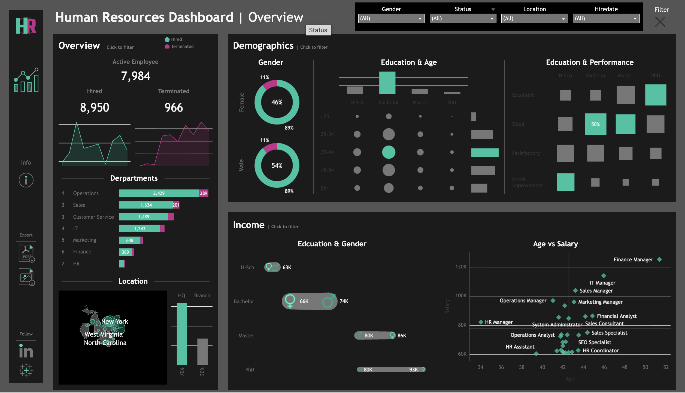

# HR Analytics Tableau Dashboard

## Overview

This project presents an interactive HR analytics dashboard built using Tableau to provide insights into workforce demographics, employee performance, compensation, and attrition.

## Dashboard Features

- Employee overview metrics
- Hiring and termination trends
- Gender distribution analysis
- Department-level insights
- Education and performance analysis
- Age and salary relationships
- Geographic employee distribution
- Interactive filters

## Tools Used

- Tableau
- Microsoft Excel
- Git
- GitHub

## Key Metrics

- Active Employees: 7,984
- Total Hired: 8,950
- Total Terminated: 966

## Key Insights

- Operations has the largest workforce among all departments.
- Male employees slightly outnumber female employees.
- Employees with advanced degrees tend to have higher compensation.
- Finance and IT managerial roles show the highest salaries.
- Hiring significantly outpaced employee termination.

## Dashboard Preview

## Tableau Public

[https://public.tableau.com/views/HumanResourcesDashboard_17843616197650/HRSummary?:language=en-US&:sid=&:redirect=auth&:display_count=n&:origin=viz_share_link]

## Author

Sean Kenneth Handoyo

- GitHub: https://github.com/seankh06
- LinkedIn: https://www.linkedin.com/in/seankennethhandoyo/
